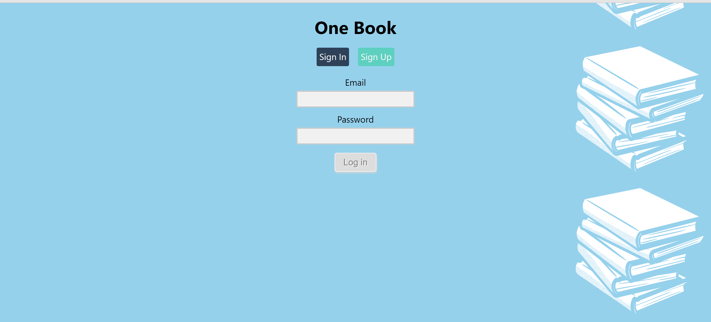
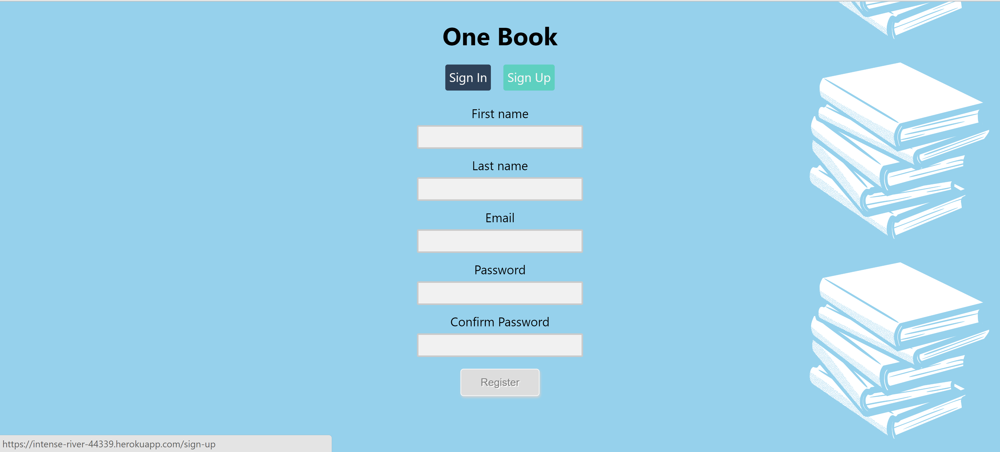
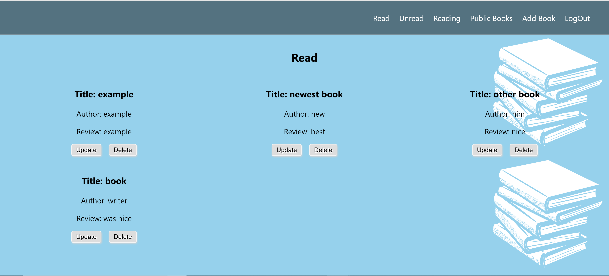
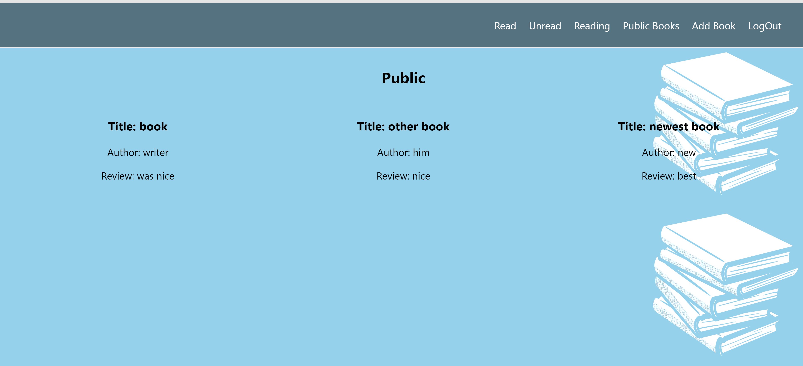
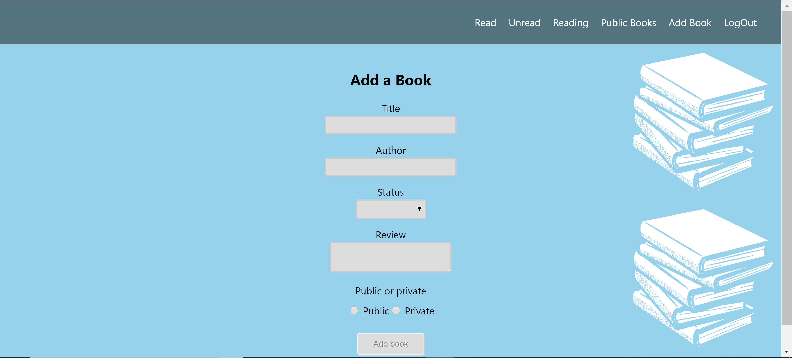
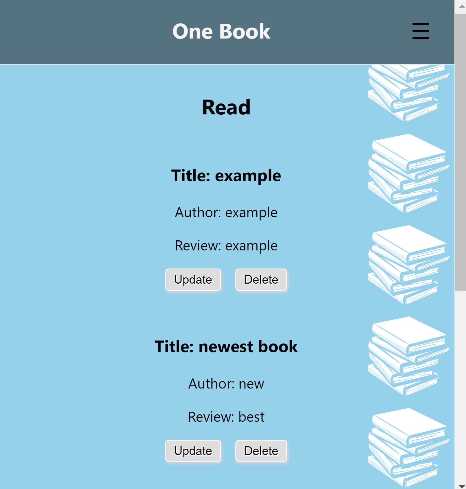
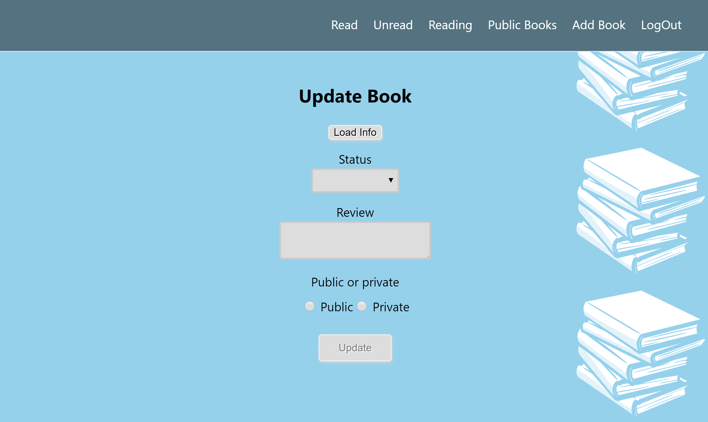

<h1>One Book</h2>
<h3> Live app here: https://intense-river-44339.herokuapp.com/sign-in </h3>
<h3>API to the app: https://github.com/oscaralexander2125/book-keeper-api</h3>

 This app is intended for the voracious reader or maybe just voracious book purchaser.
  At some point we just have to many books and would like to have a log of all of our books and have 
  it marked as read or unread with a little review about the book for yourself. Well this app does that and
  also lets your share your book and your review if you'd like. So if you'd like to have a visible
  log of what you're reading, this app is for you.
  Try the free demo with email, test@test.com and password, password1234.
  

  
  <h2>Technical Stack</h2>
  <h3>Front End</h3>
  <ul>
  <li>React</li>
  <li>Redux</li>
  <li>Redux-form</li>
  <li>React-router-dom</li>
  <li>Javascript</li>
  <li>CSS
  <ul><li>Responsive grid design for mobile screens and tablets, as well.</li></ul>
  </li>
  </ul>
  <h3>Backend</h3>
  <ul>
  <li>Node.js</li>
  <li>Express.js</li>
  <li>MongoDB</li>
  <li>Mongoose</li>
  <li>Mlab</li>
  <li>Mocha and Chai</li>
  </ul>

  <h2>Screenshots</h2>
  
  
  
  
  
  
  
  